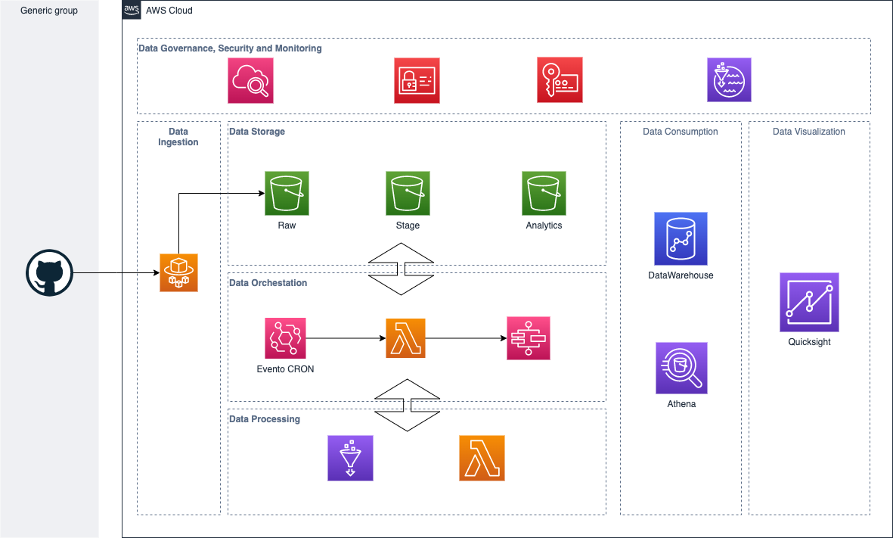

# Analisis de Mejores Jugadas de Futbol

El siguiente repositorio tiene el detalle de la implementacion y arquitectura para el proyecto de Tesis de Analisis de Mejores Jugadas de Futbol. 

Los miembros que forman parte del equipo 

- 
- 
-
-
-
-

## Contenido

1. Arquitectura
2. Estructura del Proyecto 
3. Templates

## 1. Arquitectura

La siguiente es la arquitectura propuesta para la solucion

